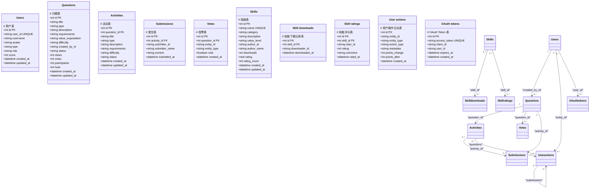

## 🗄️ 数据库 ER 图

```mermaid
classDiagram
    class users["Users"] {  # 用户表
        +int id PK
        +string user_id UNIQUE
        +string username
        +string avatar
        +string type
        +string role
        +int score
        +datetime created_at
        +datetime updated_at
    }
    
    class questions["Questions"] {  # 问题表
        +int id PK
        +string title
        +string type
        +string description
        +string requirements
        +string value_expectation
        +string difficulty
        +string created_by_id
        +string status
        +int views
        +int votes
        +int participants
        +int heat
        +datetime created_at
        +datetime updated_at
    }
    
    class activities["Activities"] {  # 活动表
        +int id PK
        +int question_id FK
        +string title
        +string type
        +string description
        +string requirements
        +string difficulty
        +string status
        +datetime created_at
        +datetime updated_at
    }
    
    class submissions["Submissions"] {  # 提交表
        +int id PK
        +int activity_id FK
        +string submitter_id
        +string submitter_name
        +string content
        +datetime submitted_at
    }
    
    class votes["Votes"] {  # 投票表
        +int id PK
        +int question_id FK
        +string entity_id
        +string entity_type
        +boolean vote
        +datetime created_at
    }
    
    class skills["Skills"] {  # 技能表
        +int id PK
        +string name UNIQUE
        +string category
        +string description
        +string value_level
        +string author_id
        +string author_name
        +int downloads
        +real rating
        +int rating_count
        +datetime created_at
        +datetime updated_at
    }
    
    class skill_downloads["Skill downloads"] {  # 技能下载记录表
        +int id PK
        +int skill_id FK
        +string downloader_id
        +datetime downloaded_at
    }
    
    class skill_ratings["Skill ratings"] {  # 技能评分表
        +int id PK
        +int skill_id FK
        +string rater_id
        +int rating
        +string comment
        +datetime rated_at
    }
    
    class user_actions["User actions"] {  # 用户操作日志表
        +int id PK
        +string entity_id
        +string entity_type
        +string action_type
        +string metadata
        +int points_change
        +int points_after
        +datetime created_at
    }
    
    class oauth_tokens["OAuth tokens"] {  # OAuth Token 表
        +int id PK
        +string access_token UNIQUE
        +string client_id
        +string user_id
        +datetime expires_at
        +datetime created_at
    }
    
    Users "1" --> "0..*" Questions : "created_by_id"
    Questions "1" --> "1" Activities : "question_id"
    Questions "1" --> "0..*" Votes : "question_id"
    Questions "1" --> "0..*" Submissions : "activity_id"
    Activities "0..*" --> "0..*" Submissions : "activity_id"
    Skills "0..*" --> "0..*" Skill downloads : "skill_id"
    Skills "0..*" --> "0..*" Skill ratings : "skill_id"
    
    Users "0" --> "0..*" User actions : "entity_id"
    Activities "0..*" --> "0..*" User actions : "questions"
    User actions "0..*" --> "0..*" User actions : "submissions"
    Users "0..*" --> "0..*" OAuth tokens : "user_id"
```

---
